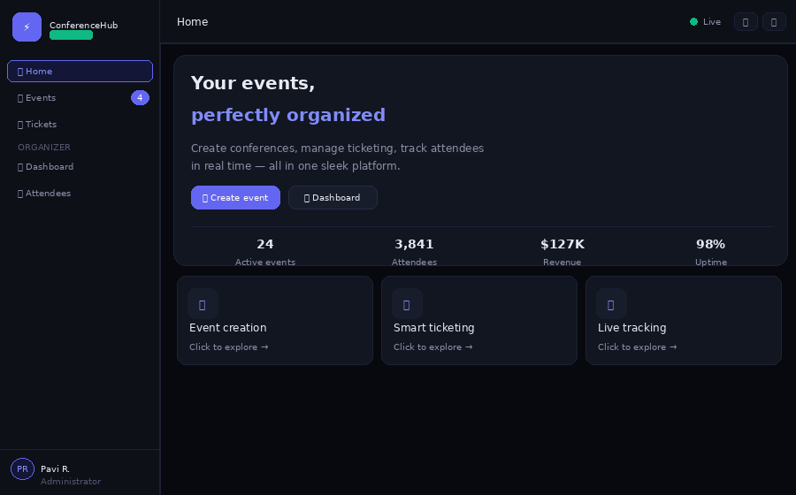

<div align="center">

# ConferenceHub

### Real-Time Event Management Platform

[](https://pavithraraavi24.github.io/conferencehub)
[](https://pavithraraavi24.github.io/conferencehub)
[](LICENSE)
[](index.html)

<br/>



> A full-featured, real-time event management platform — built as a **single HTML file** with zero frameworks and zero build steps.

</div>

---

## ✨ Features

| Feature | Description |
|---|---|
| 📅 **Event creation** | Create events with name, date, venue, category, and capacity |
| 🎫 **Multi-tier ticketing** | General · VIP · Early Bird with quantity selector and live price |
| 📊 **Live dashboard** | Revenue chart, registrations chart, activity feed — updates every 5s |
| 👥 **Attendee tracker** | Full roster with check-in status, search, and filters |
| 🔔 **Toast notifications** | Real-time alerts pop up for registrations, payments, capacity warnings |
| 🏷️ **Category filters** | Filter events by Tech, Design, AI, or Business |
| 🔍 **Search** | Search events and attendees instantly |

---

## 🖼️ Screenshots

<table>
  <tr>
    <td align="center"><strong>Home</strong></td>
    <td align="center"><strong>Events</strong></td>
  </tr>
  <tr>
    <td></td>
    <td></td>
  </tr>
  <tr>
    <td align="center"><strong>Dashboard</strong></td>
    <td align="center"><strong>Tickets</strong></td>
  </tr>
  <tr>
    <td></td>
    <td></td>
  </tr>
</table>

---

## 🛠️ Tech Stack

| Layer | Technology |
|---|---|
| Structure | HTML5 |
| Styling | CSS3 — custom properties, Grid, Flexbox |
| Charts | [Chart.js 4.4.1](https://www.chartjs.org/) via CDN |
| Icons | [Tabler Icons](https://tabler.io/icons) webfont via CDN |
| Deployment | GitHub Pages |
| Backend | None — fully client-side |

---

## 📁 Project Structure

```
conferencehub/
├── index.html          ← Complete single-file web app
├── README.md           ← This file
├── LICENSE             ← MIT License
└── screenshots/
    ├── demo.gif        ← Animated walkthrough
    ├── home.png
    ├── events.png
    ├── dashboard.png
    ├── tickets.png
    └── attendees.png
```

---

## 🚀 Getting Started

**View locally** — just open the file, no setup needed:
```bash
open index.html         # macOS
start index.html        # Windows
xdg-open index.html     # Linux
```

**Deploy your own copy:**
1. Fork this repo
2. Go to **Settings → Pages**
3. Set source to `main` branch, path `/`
4. Live at `https://YOUR-USERNAME.github.io/conferencehub`

---

## 💡 Design Decisions

**Single-file architecture** — Everything lives in `index.html`. No node_modules, no bundler, no build step. Open and it works.

**Simulated real-time** — The dashboard uses `setInterval` every 5 seconds to simulate live registrations, check-ins, and notifications. Production would use WebSockets or server-sent events.

**Dark-first theme** — Deep navy (`#07090f`) with indigo/cyan accents. All colors are CSS custom properties for easy theming.

---

## 🗺️ Pages

| Page | What it does |
|---|---|
| **Home** | Hero landing with live stats and feature overview |
| **Events** | Browse, filter, search, and create events |
| **Tickets** | Register with multi-tier pricing and quantity selector |
| **Dashboard** | Organizer analytics — charts, activity feed, notifications |
| **Attendees** | Full roster with search and real-time check-in status |

---

## 🔮 Roadmap

- [ ] Backend API (Node.js / FastAPI) for persistent data
- [ ] Real Stripe payment integration
- [ ] Email confirmation with actual QR code generation
- [ ] CSV export of attendee roster
- [ ] Multi-organizer roles (Admin, Organizer, Volunteer)
- [ ] Mobile companion app

---

## 📄 License

MIT — free to use, fork, and build on.

---

<div align="center">

Built by [Pavi R.](https://github.com/pavithraraavi24) · [Live Demo →](https://pavithraraavi24.github.io/conferencehub)

</div>
